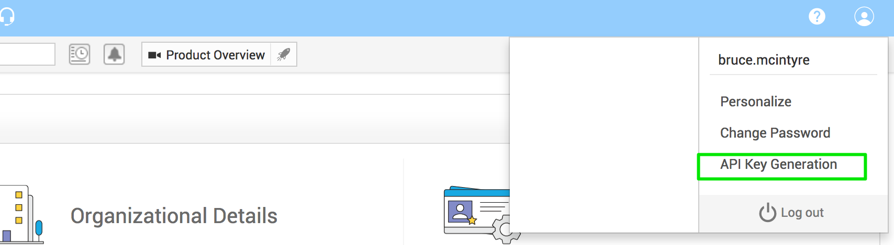
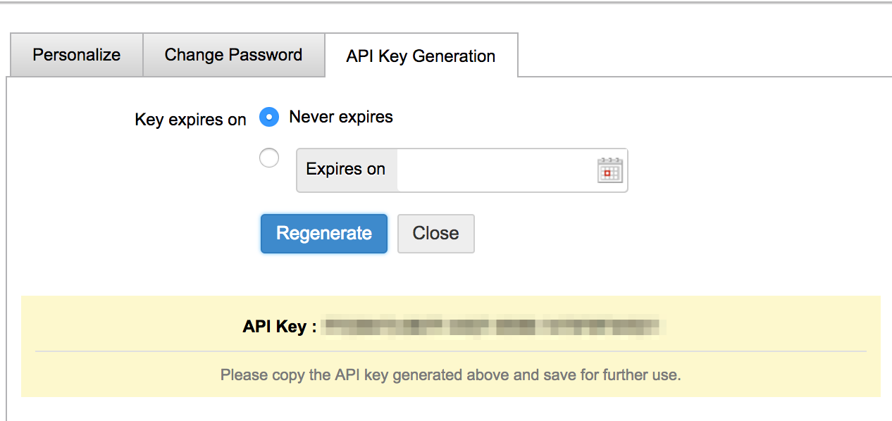

# Service Desk Plus Updated API Documentation

I was unable to find any "modern" documentation for Service Desk Plus (https://www.manageengine.com/products/service-desk/).

Here's what I found.

# Setup

Before you start you need to generate a key for yourself.

The steps are as follows:

* Log into Service Desk Plus
* Click your profile icon on the right hand top corner
* Click "API Generation"

* Click "Generate" or "Regenerate"

* Copy the key, we will use it later

# Documentation

The API documentation can be found at your instance's address with `/SetUpWizard.do?forwardTo=apidoc`

For example: `http://some-service-desk-plus.org/SetUpWizard.do?forwardTo=apidoc`

# cURL

Here is a worked example:

```
curl -k -X POST --data 'INPUT_DATA={ "operation": { "details": { "filterby": "All_Requests", "from": "0", "limit": "10" } } }'  | python -m json.tool 'https://some-service-desk-plus.org/sdpapi/request/?TECHNICIAN_KEY=xxxx-xxxx-xxxx&OPERATION_NAME=GET_REQUESTS&format=json'`
```

This produces JSON that's usable:

```
{
    "operation": {
        "SSP_SETTINGS": {
            "DISABLE_DEFAULT_REQUEST_TEMPLATE": false,
            "GLOBAL_REQUEST_ONHOLD_OPTION": "false",
            "REQUESTER_CLOSE_OPTION": "false",
            "REQUESTER_REOPEN_OPTION": "false"
        },
        "details": [
            {
                "CREATEDBY": "System",
                "CREATEDTIME": 1489073903156,
                "DUEBYTIME": -1,
                "ISOVERDUE": "false",
                "REQUESTER": "Devili Abrams",
                "STATUS": "Open",
                "SUBJECT": "Re: Floo for Big Things / Replacement of CoffeePot",
                "WORKORDERID": 331915
            },
            {
                "CREATEDBY": "System",
                "CREATEDTIME": 1489072992562,
                "DUEBYTIME": -1,
                "ISOVERDUE": "false",
                "REQUESTER": "Promise Mawasha",
                "STATUS": "Open",
                "SUBJECT": "[ #1-xxxx] Assignment Notification: Bouncing back of foobar.org mails - URGENT",
                "WORKORDERID": 331914
            },
            {
                "CREATEDBY": "System",
                "CREATEDTIME": 1489072631312,
                "DUEBYTIME": -1,
                "ISOVERDUE": "false",
                "REQUESTER": "Diaba Nakeni",
                "STATUS": "Open",
                "SUBJECT": "POP",
                "WORKORDERID": 331913
            },
            {
                "CREATEDBY": "System",
                "CREATEDTIME": 1489072087812,
                "DUEBYTIME": -1,
                "ISOVERDUE": "false",
                "REQUESTER": "Anja Vermaas (Ignite)",
                "STATUS": "Open",
                "SUBJECT": "RE:  Take-Down Notice TDN.#0000 ",
                "TECHNICIAN": "Keinan Volkov",
                "WORKORDERID": 331912
            },
            {
                "CREATEDBY": "Theodoar Downer",
                "CREATEDTIME": 1489072047484,
                "DUEBYTIME": 1489154847484,
                "ISOVERDUE": "false",
                "PRIORITY": "P4",
                "REQUESTER": "BIG-TOP (PTY) LTD",
                "STATUS": "Resolved",
                "SUBJECT": "packet loss",
                "TECHNICIAN": "Theodoar Downer",
                "WORKORDERID": 331911
            },
            {
                "CREATEDBY": "System",
                "CREATEDTIME": 1489071905515,
                "DUEBYTIME": -1,
                "ISOVERDUE": "false",
                "REQUESTER": "DYNEAMIC WIDGETS",
                "STATUS": "Open",
                "SUBJECT": "Re: Cancellation - metalevents.co.za",
                "WORKORDERID": 331910
            },
            {
                "CREATEDBY": "System",
                "CREATEDTIME": 1489071782125,
                "DUEBYTIME": -1,
                "ISOVERDUE": "false",
                "REQUESTER": "Domain Notification",
                "STATUS": "Open",
                "SUBJECT": "Domain Renewals",
                "WORKORDERID": 331909
            },
            {
                "CREATEDBY": "Pravin Cary",
                "CREATEDTIME": 1489071517453,
                "DUEBYTIME": 1489132717453,
                "ISOVERDUE": "false",
                "PRIORITY": "P2",
                "REQUESTER": "XXX PRODUCTS (PTY) LTD",
                "STATUS": "Open",
                "SUBJECT": "High latency and packet drops -VPN DOWN",
                "WORKORDERID": 331908
            },
            {
                "CREATEDBY": "System",
                "CREATEDTIME": 1489071116390,
                "DUEBYTIME": -1,
                "ISOVERDUE": "false",
                "REQUESTER": "Customer Service Centre",
                "STATUS": "Open",
                "SUBJECT": "HIGH INCIDENT NOTIFICATION",
                "WORKORDERID": 331907
            },
            {
                "CREATEDBY": "John Doe",
                "CREATEDTIME": 1489071055703,
                "DUEBYTIME": 1489132255703,
                "ISOVERDUE": "false",
                "PRIORITY": "P2",
                "REQUESTER": "Marius Marx",
                "STATUS": "Open",
                "SUBJECT": "Lorem ipsum",
                "TECHNICIAN": "John Doe",
                "WORKORDERID": 331906
            }
        ],
        "module": "GET_REQUESTS",
        "name": "GET_REQUESTS",
        "resources": [],
        "result": {
            "message": "WorkOrder Details Retrieved Successfully",
            "status": "Success"
        }
    }
}

```

There we are.
